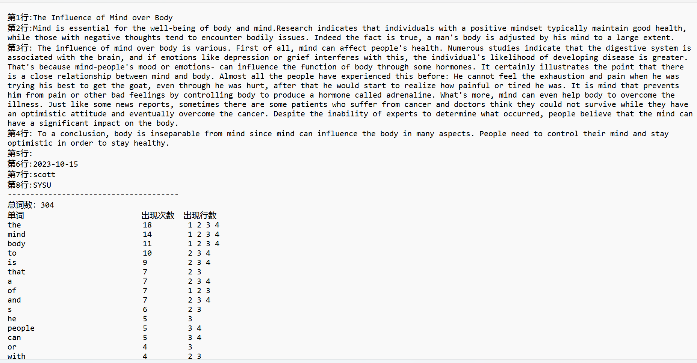
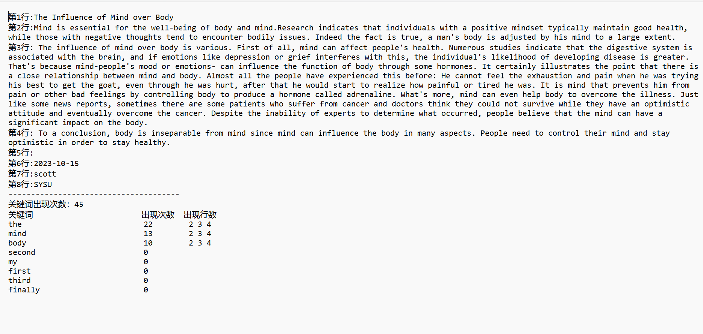
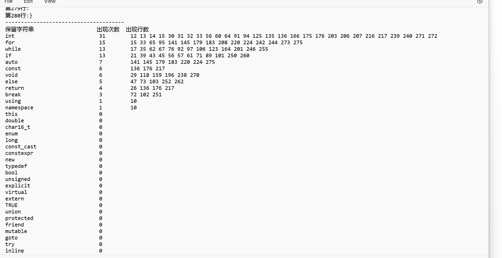
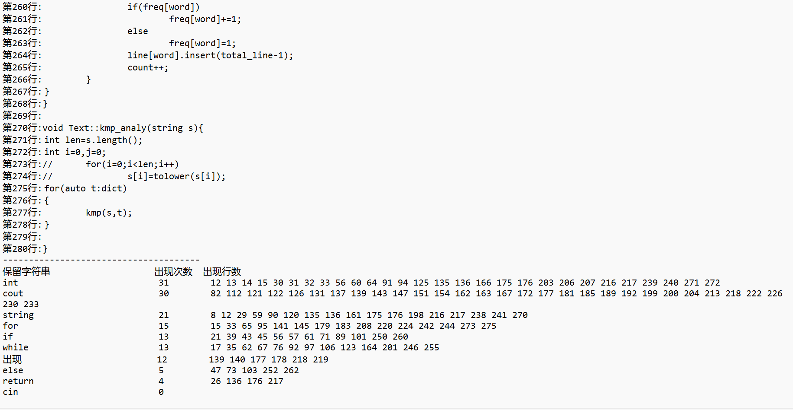
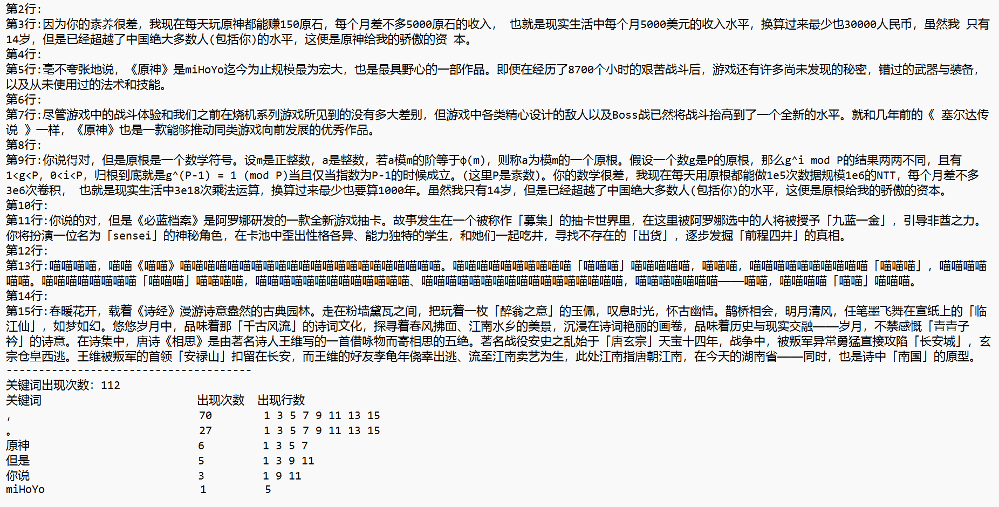

# <center>Project3 &emsp;实验报告</center>

#### <center>学号：22336289 &emsp;&emsp;&emsp;姓名：袁鹏湘</center>

### 实验内容

设计一个程序以分析文本，输出每个词的出现次数，以及出现位置所在的行号。具体包括：以txt格式存储的英文短文，统计词频值Top-K的单词；C/C++语言编写的源代码，以保留字符集作为待统计的词汇集；常见的中文文本，自定义关键词统计。


---

### 功能说明  
根据界面的指示输入操作代码，选择合适的分析方式，并输入正确的源文件名字（不在当前目录下时，需要使用绝对路径或相对路径指明）， 有自定义关键词的，也需要输入正确的关键词文件名字 ，即可分析文本（文本名字可以自定义，实验报告中为了方便统一用test和key起名，实际上可以用任意名字）。结果会保存在当前目录下的Running Log.txt文件中。如果含中文字符，请确保文件格式以ANSI保存，用UTF-8的编码方式会导致不兼容GBK而乱码！

#### 示例  

+ 示例1  （英文短文 test1.txt）

> The Influence of Mind over Body
> Mind is essential for the well-being of body and mind. Research indicates that individuals with a positive mindset typically maintain good health, while those with negative thoughts tend to encounter bodily issues. Indeed the fact is true, a man's body is adjusted by his mind to a large extent.
>  The influence of mind over body is various. First of all, mind can affect people's health. Numerous studies indicate that the digestive system is associated with the brain, and if emotions like depression or grief interferes with this, the individual's likelihood of developing disease is greater. That's because mind-people's mood or emotions- can influence the function of body through some hormones. It certainly illustrates the point that there is a close relationship between mind and body. Almost all the people have experienced this before: He cannot feel the exhaustion and pain when he was trying his best to get the goat, even through he was hurt, after that he would start to realize how painful or tired he was. It is mind that prevents him from pain or other bad feelings by controlling body to produce a hormone called adrenaline. What's more, mind can even help body to overcome the illness. Just like some news reports, sometimes there are some patients who suffer from cancer and doctors think they could not survive while they have an optimistic attitude and eventually overcome the cancer. Despite the inability of experts to determine what occurred, people believe that the mind can have a significant impact on the body.
>  To a conclusion, body is inseparable from mind since mind can influence the body in many aspects. People need to control their mind and stay optimistic in order to stay healthy.
>
> 2023-10-15
> scott
> SYSU 

1、使用默认分析的结果：  
  

2、使用自定义关键词文件（key1.txt）的结果：  
(PS: 自定义关键词会严格按照关键词**区分大小写**来精确地分析，默认分析则不会)  
  


+ 示例2  （代码片段 test2.txt截取部分）

> #include "analy.h"
> #include <fstream>
> #include <iostream>
> #include <iomanip>
> #include <unordered_map>
> #include <set>
> #include <algorithm>
> #include <string>
> #include <cctype>
> using namespace std;
>
> vector<int> Text::get_next(string& t){
>     int len=t.size();
>     vector<int> next(len,0);
>     for(int i=1,j=0;i<len;i++)
> 	{
>         while(j>0&&t[i]!=t[j])
> 		{
>             j=next[j-1];
>         }
>         if(t[i]==t[j]) {
>             j++;
>         }
>         next[i]=j;
>     }
>     return next;
> }
> ......    #这里展示的并不完整！


1、使用默认分析的结果：    
    

2、使用自定义关键词文件（key2.txt）的结果：    
    


+ 示例3  （中文文本  test3.txt）

PS:由于文本量过大，不展示输入了

使用自定义关键词文件（key3.txt）的结果：  
    


---

### 关键代码展示  

+ #### analy.h头文件展示  

```c++
#ifndef _ANALY_H_
#define _ANALY_H_
#include <fstream>
#include <unordered_map>
#include <set>
#include <vector>
#include <algorithm>
#include <string>
#include <cctype>
using namespace std;

class Text{
	public: 
		Text(ifstream& inFile,int choose);//无自定义关键词
		Text(ifstream& inFile,ifstream& keyFile);//自定义关键词文件 
		
		void read1();//英语短文单词 
		void read2();//c语言程序保留字符串
		void read3();//自定义关键词 
		
		void analy(string s);//分析英语源文本 
		void kmp_analy(string s);//KMP算法匹配 
		
	private:
		set<string> dict;//分词表 
		unordered_map<string,set<int>> line;//记录出现的行数 
		unordered_map<string,int> freq;//记录出现的次数
		int total_line;//总行数
		int total_word;//总词数
		int key_count;//关键词数 
		int count;//总词数 
		ifstream* inFile;//暂存输入流 
		
		vector<int> get_next(string& pattern);
		void kmp(string& s,string& t);
};

#endif //_ANALY_H_
```

+ #### analy.cpp展示  

```c++
#include "analy.h"
#include <fstream>
#include <iostream>
#include <iomanip>
#include <unordered_map>
#include <set>
#include <algorithm>
#include <string>
#include <cctype>
using namespace std;

/*kmp算法的next数组获取和kmp匹配分析*/
vector<int> Text::get_next(string& t){
    int len=t.size();
    vector<int> next(len,0);
    for(int i=1,j=0;i<len;i++)
	{
        while(j>0&&t[i]!=t[j])
		{
            j=next[j-1];
        }
        if(t[i]==t[j]) {
            j++;
        }
        next[i]=j;
    }
    return next;
}

void Text::kmp(string& s,string& t){
    vector<int> next=get_next(t);
    int n=s.size();
    int m=t.size();
    for(int i=0,j=0;i<n;i++)
	{
        while(j>0&&s[i]!=t[j])
		{
            j=next[j-1];
        }
        if(s[i]==t[j])
		{
            j++;
        }
        if(j==m)
		{
			if(!freq[t])
			freq[t]=1;
			else
            freq[t]+=1;
            
            key_count+=1;
            line[t].insert(total_line-1);
            j=next[j-1];
        }
    }
}
/*构造函数，分两个：一个用于默认分析，一个用于有自定义关键词文件的分析*/
Text::Text(ifstream& inFile,int choose):inFile(&inFile),total_line(1),total_word(0),count(0),key_count(0){
	if(choose==1)
	{
		string s,word;
		int i=0,j=0;
		ifstream inFile("cpp_reserved.txt");
		while(getline(inFile,s))
		{
			int len=s.length();
			for(i=0;i<len;)
			{
				while(i<len&&(s[i]==' '||s[i]=='\n'))
				{
					i++;
				}
				if(i==len)
				break;
				else
				{
					j=i;
					while(i<len&&s[i]!=' '&&s[i]!='\n')
					{
						i++;
					}
					word=s.substr(j,i-j);
					dict.insert(word);
//					cout<<word<<" ";
				}
			}
		}
	}
}

Text::Text(ifstream& inFile,ifstream& keyFile):inFile(&inFile),total_line(1),total_word(0),count(0),key_count(0){
		string s,word;
		int i=0,j=0;
		while(getline(keyFile,s))
		{
			int len=s.length();
			for(i=0;i<len;)
			{
				while(i<len&&(s[i]==' '||s[i]=='\n'))
				{
					i++;
				}
				if(i==len)
				break;
				else
				{
					j=i;
					while(i<len&&s[i]!=' '&&s[i]!='\n')
					{
						i++;
					}
					word=s.substr(j,i-j);
					dict.insert(word);
//					cout<<word<<" ";
				}
			}
		}
}
/*三个read（）函数其实大同小异，只是采用的分析方式不同，输出格式有不同*/
void Text::read1(){
	ofstream outFile("Running Log.txt");
	string s;//每次读取一行
	cout<<endl<<"成功读取以下内容："<<endl; 
	cout<<"--------------------------------------"<<endl;
	if(dict.size())
		for(auto cur:dict)
			freq[cur]=0;
	while(getline(*inFile,s,'\n'))
	{
		int temp=total_line++;
		cout<<"第"<<temp<<"行:"<<s<<endl;
		outFile<<"第"<<temp<<"行:"<<s<<endl;
		analy(s);
	}
	total_line--;
	cout<<"--------------------------------------"<<endl;
	outFile<<"--------------------------------------"<<endl;
	
	/*排序输出Top-K的单词*/ 
	vector<pair<string,int>> temp(freq.begin(),freq.end());
	sort(temp.begin(),temp.end(),[](const pair<string,int>& a, const pair<string,int>& b){return a.second>b.second;});
	cout<<"总词数："<<count<<endl; 
	outFile<<"总词数："<<count<<endl; 
	cout<<left<<setw(30)<<"单词"<<left<<setw(10)<<"出现次数"<<left<<setw(10)<<"出现行数"<<endl;
	outFile<<left<<setw(30)<<"单词"<<left<<setw(10)<<"出现次数"<<left<<setw(10)<<"出现行数"<<endl;
	for(auto cur:temp)
	{
		cout<<left<<setw(30)<<cur.first<<left<<setw(10)<<cur.second;
		outFile<<left<<setw(30)<<cur.first<<left<<setw(10)<<cur.second;
		for(auto cur2:line[cur.first])
		{
			cout<<cur2<<" ";
			outFile<<cur2<<" ";
		}
			
		cout<<endl;
		outFile<<endl;
	}
	cout<<"--------------------------------------"<<endl;
	outFile.close();
}


void Text::read2(){
	ofstream outFile("Running Log.txt");
	string s;//每次读取一行
	cout<<endl<<"成功读取以下内容："<<endl; 
	cout<<"--------------------------------------"<<endl;
	if(dict.size())
		for(auto cur:dict)
			freq[cur]=0;
	while(getline(*inFile,s,'\n'))
	{
		int temp=total_line++;
		cout<<"第"<<temp<<"行:"<<s<<endl;
		outFile<<"第"<<temp<<"行:"<<s<<endl;
		kmp_analy(s);
	}
	total_line--;
	cout<<"--------------------------------------"<<endl;
	outFile<<"--------------------------------------"<<endl;
	
	vector<pair<string,int>> temp(freq.begin(),freq.end());
	sort(temp.begin(),temp.end(),[](const pair<string,int>& a, const pair<string,int>& b){return a.second>b.second;});
	cout<<left<<setw(30)<<"保留字符串"<<left<<setw(10)<<"出现次数"<<left<<setw(10)<<"出现行数"<<endl;
	outFile<<left<<setw(30)<<"保留字符串"<<left<<setw(10)<<"出现次数"<<left<<setw(10)<<"出现行数"<<endl;
	for(auto cur:temp)
	{
		cout<<left<<setw(30)<<cur.first<<left<<setw(10)<<cur.second;
		outFile<<left<<setw(30)<<cur.first<<left<<setw(10)<<cur.second;
		for(auto cur2:line[cur.first])
		{
			cout<<cur2<<" ";
			outFile<<cur2<<" ";
		}
			
		cout<<endl;
		outFile<<endl;
	}
	cout<<"--------------------------------------"<<endl;
	outFile.close();
}

void Text::read3(){
	ofstream outFile("Running Log.txt");	
	string s;//每次读取一行
	cout<<endl<<"成功读取以下内容："<<endl; 
	cout<<"--------------------------------------"<<endl;
	if(dict.size())
		for(auto cur:dict)
			freq[cur]=0;
	while(getline(*inFile,s,'\n'))
	{
		int temp=total_line++;
		cout<<"第"<<temp<<"行:"<<s<<endl;
		outFile<<"第"<<temp<<"行:"<<s<<endl;
		int len=s.length();
		int i=0;
		kmp_analy(s);
	}
	total_line--;
	cout<<"--------------------------------------"<<endl;
	outFile<<"--------------------------------------"<<endl;
	
	cout<<"关键词出现次数："<<key_count<<endl;
	outFile<<"关键词出现次数："<<key_count<<endl;
	
	vector<pair<string,int>> temp(freq.begin(),freq.end());
	sort(temp.begin(),temp.end(),[](const pair<string,int>& a, const pair<string,int>& b){return a.second>b.second;});
	cout<<left<<setw(30)<<"关键词"<<left<<setw(10)<<"出现次数"<<left<<setw(10)<<"出现行数"<<endl;
	outFile<<left<<setw(30)<<"关键词"<<left<<setw(10)<<"出现次数"<<left<<setw(10)<<"出现行数"<<endl;
	for(auto cur:temp)
	{
		cout<<left<<setw(30)<<cur.first<<left<<setw(10)<<cur.second;
		outFile<<left<<setw(30)<<cur.first<<left<<setw(10)<<cur.second;
		for(auto cur2:line[cur.first])
		{
			cout<<cur2<<" ";
			outFile<<cur2<<" ";
		}
			
		cout<<endl;
		outFile<<endl;
	}
	cout<<"--------------------------------------"<<endl;
	outFile.close();
}

/*默认分析方法，一次读取一行后，对字符串按空格分词*/
void Text::analy(string s){
	int len=s.length();
	int i=0,j=0;
	string word;
	for(i=0;i<len;i++)
		s[i]=tolower(s[i]);		
	for(i=0;i<len;)
	{
		while(i<len&&!isalnum(s[i]))
		{
			i++;
		}
		if(i==len)
		break;
		else
		{
			j=i;
			while(i<len&&isalnum(s[i]))
			{
				i++;
			}
			word=s.substr(j,i-j);
			if(freq[word])
				freq[word]+=1;
			else
				freq[word]=1;
			line[word].insert(total_line-1);
			count++;
		}
	}
}

/*采用了kmp算法的分析方法，按照kmp算法进行分词而不是空格*/
void Text::kmp_analy(string s){
	int len=s.length();
	int i=0,j=0;
//	for(i=0;i<len;i++)
//		s[i]=tolower(s[i]);
	for(auto t:dict)
	{
		kmp(s,t);
	}
	
}
```